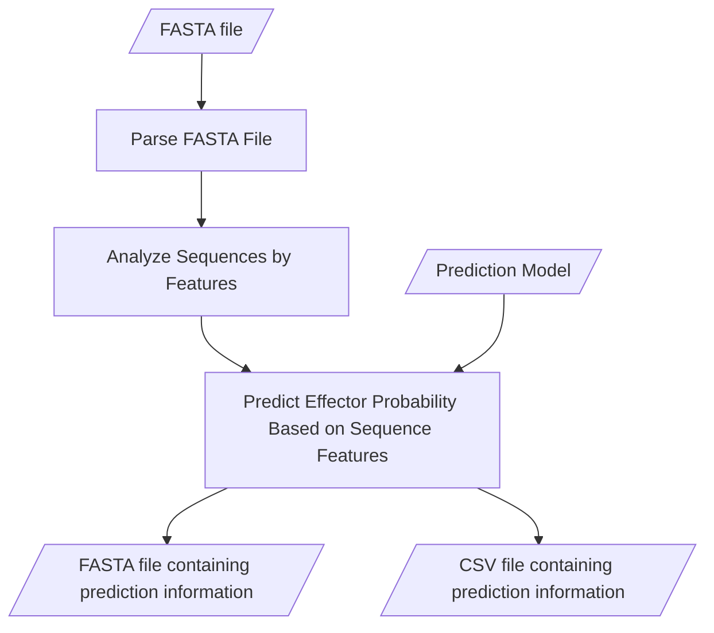

# EffectorO-1.0

Note: If you have any trouble running this, please email collaborators at:

- Kelsey Wood: **<kjwood@ucdavis.edu>**
- Munir Nur: **<mjnur@ucdavis.edu>**
- Nikko Sanchez: **<niksanchez@ucdavis.edu>**

## About

EffectorO is an effector prediction tool that aims to perform predictions using the following approaches:

1. A machine learning-based pipeline that predicts effector probability based on the biochemical properties of the N-terminal amino acid sequence of a protein (**EffectorO-ML**)
2. A pipeline based on lineage-specificity to find proteins that are unique to one species or genus, a sign of evolutionary divergence due to adaptation to the host (**Effector-LSP**)

Please see the [EffectorO paper](https://www.biorxiv.org/content/10.1101/2021.03.19.436227v2) for more detailed information.

### EffectorO-ML Pipeline

Prior to using a prediction model to predict the likelihood of FASTA sequences being effectors, the input FASTA file is parsed and each sequence is analyzed for the following features:

- Grand Average of Hydropathy (GRAVY)
- Hydrophobicity
- Exposed Residues
- Disorder Propensity
- Bulkiness
- Interface Propensity

The file `ml_src/FEAT.py` contains amino acid scales for each feature as well as documentation of where the amino acid scales come from.

The information of each feature for each sequence is fed and analyzed by the prediction model to output a probability for each sequence. The results of the prediction model are used to create two output files:

- FASTA file containing effector prediction information in the headers
- CSV file providing similar information as the FASTA file in a tabular format

#### Pipeline Visualization



## Getting Started

### Using the Command Line Interface (Linux)

Here are the required dependencies based on each approach provided by EffectorO.

**EffectorO-ML:**

- Python (versions <= 3.7)
- scikit-learn (versions <= 0.19)
- joblib
- Biopython
- pandas
- NumPy

There are multiple ways to install these dependencies (listed below).

### Using conda

First you have to install conda. If you do not have conda installed on your machine, use this [guide](https://conda.io/projects/conda/en/latest/user-guide/install/index.html) to aid your installation process.

After conda is successfully installed on your machine, create an conda environment using the following command:

```shell
conda env create -f environment_setup/cli-conda-environment.yml
```

Once the environment is created, the `(base)` next to your username should now be `(effectoro-cli)`.

### Using `requirements.txt`

In order to use requirements.txt, you must have Python version 3.5-3.7 on your environment. Install the necessary dependencies via the following command:

```bash
pip install -r environment_setup/requirements.txt
```

## Running EffectorO-ML

### EffectorO-ML

```bash
python3 effectorO_ml.py
    -i PATH/TO/INPUT_FILE.fasta
    [-m <OPTIONAL/PATH/TO/MODEL_FILE>]
        # uses trained_models/RF_88_best.sav by default
    [-o <OUTPUT/OUTPUT/DIRPATH>]
        # creates effectoro_results if not specified
    [-s]
        # silences print statements
```
